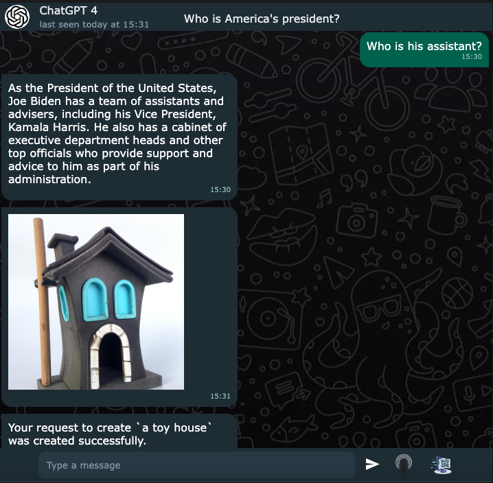

<h1 style="font-family: Arial, sans-serif;"># ChatGPT Backend Integration API (Front End Included) </h1>

This API allows you to integrate the ChatGPT language model into your application's frontend. With this API, you can send text inputs to the model and receive responses in real-time.
Sample image below...

<h2 style="font-family: Arial, sans-serif;">Installation</h2>

To use this API, you will need to have Golang go1.20.2  or higher installed on your machine. You can download Golang from the official website: https://golang.org/

<h3 style="font-family: Arial, sans-serif;">Clone this repository to your local machine.</h3>
Install the required packages by running go get requirements.txt in your terminal.
Start the server by running go run main.go in your terminal.

<h3 style="font-family: Arial, sans-serif;">Endpoints</h3>
The API has the following endpoints:

	localhost:8080/gpt_to_text
    localhost:8080/gpt3_completion
	localhost:8080/gpt3_streaming
	localhost:8080/gpt_streaming
	localhost:8080/gpt_image_gen
	localhost:8080/gpt_speach_to_text

<h3 style="font-family: Arial, sans-serif;">Request Parameters</h3>
The POST /gpt_to_text endpoint takes a JSON request body with the following parameters:
The POST /gpt_speach_to_text endpoint takes a JSON request body (The URL to the audio):

text (string): the input text to send to the ChatGPT model.
Here's an example request body:

<h3 style="font-family: Arial, sans-serif;">json</h3>
{
    "text": "Hi, how are you doing today?"
}

<h3 style="font-family: Arial, sans-serif;">Response</h3>

The POST /gpt_to_text endpoint returns a JSON response body with the following fields:

response (string): the response text generated by the ChatGPT model.
Here's an example response body:

<h3 style="font-family: Arial, sans-serif;">json</h3>

{
    "response": "I'm doing well, thank you for asking. How about you?"
}

<h3 style="font-family: Arial, sans-serif;">Contributing</h3>

Contributions are welcome! Please open an issue first to discuss what you would like to change.

<h3 style="font-family: Arial, sans-serif;">License</h3>

This project is licensed under the MIT License - see the LICENSE file for details.
